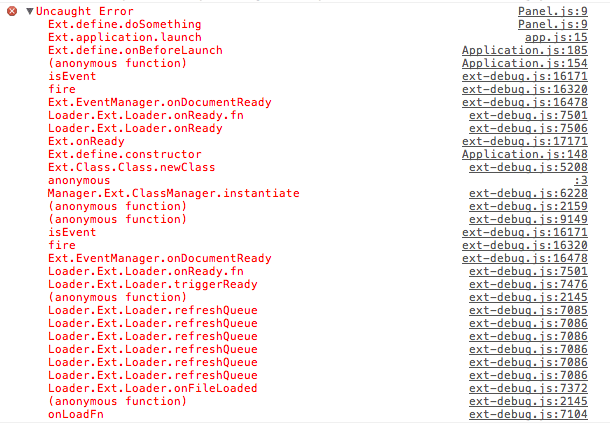

## 概述
Ext本身包括数百个类。我们迄今已有超过200万的开发人员，他们来自不同的背景和地点。在规模上
我们面临着提供一个通用代码架构的巨大挑战：
```
    - 简单易学
    - 快速开发，容易调试和无痛部署
    - 有组织，可扩展和可维护
```
<!-- more -->

因为js是一门弱化了类的，基于原型的一门语言，其最强大的功能之一就是灵活性。使用许多不同编码风格和技术的任何问题都有多种解决方案。然而，这带来了不可预测的代价。没有统一的结构，JavaScript代码可能难以理解，维护和重用。

基于类的编程，在另一外面来说，它是非常流行的面向对象编程模型。基于类的语言通常需要强类型，封装和标准编码约定。
通过使开发人员遵守一大套原则，代码更有可能随时间推移而可预测，可伸缩和可扩展。但是，该模型没有js的动态功能。

每种方法都有利弊，但是我们能够取两者之精华，去两者之糟粕吗？答案是肯定的，Extjs就是你可以使用的解决方案。

## 命名约定
在代码库中使用一致的命名约定，用于类，命名空间和文件名，有助于保持代码的组织，结构化和可读性。

## 类
类名只能包含字母数字字符。允许数字但不鼓励，除非它们属于技术术语。不要使用下划线，连字符或任何其他非字母数字字符。 例如：

```
MyCompany.useful_util.Debug_Toolbar 是不好的实践
MyCompany.util.Base64 是好的实践
```

适当的时候和使用对象属性的（.）访问时，类名应该分组成包。至少，他们应该有一个顶级的唯一的命名空间。
例如：
```js
MyCompany.data.CoolProxy
MyCompany.Application
```

顶级的命令空间和实际的类名应该遵循CamelCase命名规范。其他的都是小写。
例如：
```js
MyCompany.form.action.AutoLoad
```
不由Sencha分发的类不应该使用Ext作为顶级命名空间.

首字母缩写也应该遵循上面的Camel命名规范。例如：
```
Ext.data.JsonProxy 取代 Ext.data.JSONProxy
MyCompany.util.HtmlParser 取代 MyCompary.parser.HTMLParser
MyCompany.server.Http 取代 MyCompany.server.HTTP
```

## 源文件

类的名称直接映射到存储它们的文件路径，因此，每个文件只能有一个类。 例如：
```
Ext.util.Observable 存储在 path/to/src/Ext/util/Observable.js
Ext.form.action.Submit 存储在 path/to/src/Ext/form/action/Submit.js
MyCompany.chart.axis.Numeric 存储在 path/to/src/MyCompany/chart/axis/Numeric.js
```
<strong>path/to/src</strong>是你应用的所有类的源文件目录。所有类都应该保留在这个共同的根目录下，并且应该被正确地命名，为了最佳的开发，维护和部署经验。

## 方法和变量
```
1、和类名一样，方法和变量名称应该只包含字母数字。允许数字但不鼓励，除非它们属于技术术语。
不要使用下划线，连字符或任何其他非字母数字字符。 

2、方法和变量名称应该遵循camelCase命名规范。这也适用于首字母缩略词。


```

例如：

可接受的方法名称：
```js
encodeUsingMd5()
getHtml() 取代 getHTML()
getJsonResponse() 取代 getJSONResponse()
parseXmlContent() 取代 parseXMLContent()
```

可接受的变量名：
```js
var isGoodName
var base64Encoder
var xmlReader
var httpServer
```

## 属性

类的属性名称遵循和方法变量完全相同的约定，除非是静态常量。
静态类属性是一个常量，应该全部大写。例如：
```js
Ext.MessageBox.YES = "Yes"
Ext.MessageBox.NO = "No"
MyCompany.alien.Math.PI = "4.13"
```

## 声明

你可以使用Ext.define这一个方法来定义类。基本语法如下：
```js
Ext.define(className, members, onClassCreated);
```

```
className: 类名称
members：一个对象，定义该类的所有成员。
onClassCreated: 是一个可选的回调函数，当这个类加载完所有的依赖并且创建成功之后调用。由于类的创建是异步的，
这个回调在大多数情况下都是很有用的。
```

例：
```js
Ext.define('My.sample.Person', {
    name: 'Unknown',

    constructor: function(name) {
        if (name) {
            this.name = name;
        }
    },

    eat: function(foodType) {
        alert(this.name + " is eating: " + foodType);
    }
});

var bob = Ext.create('My.sample.Person', 'Bob');

bob.eat("Salad"); // alert("Bob is eating: Salad");
```
<strong>注意：</strong>我们通过Ext.create()创建了一个My.samle.Person类的实例。也可以
使用new关键字来创建（new My.sample.Person()）。但是建议您始终使用Ext.create，因为它允许您利用动态加载。


## 配置
还有一个专用的配置（config）属性，在类创建之前由强大的Ext.Class预处理器处理。 功能包括：
```
1、对其他类配置来说，config是完全封装的；
2、如果方法尚未定义，则每个配置属性的Getter和setter方法在类创建过程中自动生成到类原型中；
3、自动生成的setter方法在设置值之前调用apply方法（如果在类上定义），如果在设置值之前需要运行自定义逻辑，则可以覆盖config属性的apply方法。如果您的apply方法不返回值，则setter将不会设置该值。当设置不同的值时，还将调用update方法（如果已定义）。apply和update方法都有两个参数，分别是旧值和新值。
```

对于Ext的类，你不需要手动调用initConfig。但是，如果你自己的类继承自Ext.Base的话，initConfig需要被调用。

你可以看一下这个config的例子。

```js
Ext.define('My.own.Window', {
   extend: 'Ext.Component',
   /** @readonly */
   isWindow: true,

   config: {
       title: 'Title Here',

       bottomBar: {
           height: 50,
           resizable: false
       }
   },

   applyTitle: function(title) {
       if (!Ext.isString(title) || title.length === 0) {
           alert('Error: Title must be a valid non-empty string');
       }
       else {
           return title;
       }
   },

   applyBottomBar: function(bottomBar) {
       if (bottomBar) {
           if (!this.bottomBar) {
               return Ext.create('My.own.WindowBottomBar', bottomBar);
           }
           else {
               this.bottomBar.setConfig(bottomBar);
           }
       }
   }
});

/** A child component to complete the example. */
Ext.define('My.own.WindowBottomBar', {
   config: {
       height: undefined,
       resizable: true
   }
});
```

下面是如何使用的例子：

```js
var myWindow = Ext.create('My.own.Window', {
    title: 'Hello World',
    bottomBar: {
        height: 60
    }
});

alert(myWindow.getTitle()); // alerts "Hello World"

myWindow.setTitle('Something New');

alert(myWindow.getTitle()); // alerts "Something New"

myWindow.setTitle(null); // alerts "Error: Title must be a valid non-empty string"

myWindow.setBottomBar({ height: 100 });

alert(myWindow.getBottomBar().getHeight()); // alerts 100
```

## Statics
静态成员可以使用statics配置。
```js
Ext.define('Computer', {
    statics: {
        instanceCount: 0,
        factory: function(brand) {
            // 'this' in static methods refer to the class itself
            return new this({brand: brand});
        }
    },

    config: {
        brand: null
    }
});

var dellComputer = Computer.factory('Dell');
var appleComputer = Computer.factory('Mac');

alert(appleComputer.getBrand()); // using the auto-generated getter to get the value of a config property. Alerts "Mac"
```

## 错误处理和调试

Extjs包含了一些有用的特性能够帮助你调试和处理错误。

1、你可以使用Ext.getDisplayName()获取到任何方法的显示名称。这对于在其描述中抛出具有类名称和方法名称的错误特别有用：
```js
 throw new Error('['+ Ext.getDisplayName(arguments.callee) +'] Some message here');
```
当使用Ext.define定义的任何类的任何方法中抛出错误时，如果使用基于WebKit的浏览器（Chrome或者Safari）,则应该在调用的堆栈中看到方法和类名。例如，以下是chrome的截图：



原文地址：http://docs.sencha.com/extjs/6.5.0/guides/core_concepts/classes.html
