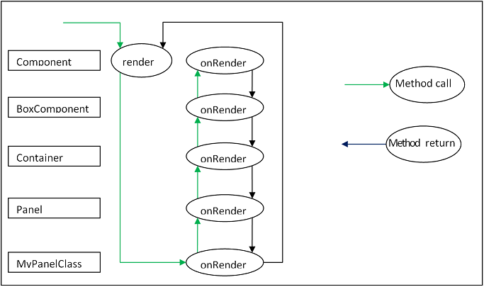

## 组件
一个ExtJS的应用的UI是由许多的组件组成的。所有的组件都是Ext.Component的子类，这使得它们能够进行自动化生命周期管理，包括实例化，渲染，大小和定位以及销毁。ExtJS提供了各种开箱即用的组件，任何组件都能够轻松扩展，以创建自定义的组件。

<!-- more -->

## 组件层次结构
容器（Container）是一个可以容纳其它组件的特殊组件。典型的应用程序由树状结构中的许多嵌套组件组成，称为组件层次结构。容器负责管理子组件的组件生命周期，包括创建，呈现，调整大小和定位以及销毁。典型的应用程序的组件层次结构从顶部的Viewport组件开始，其中包含嵌套在其中的其他容器/组件：


子组件通过容器的items配置添加到容器中。这个例子使用Ext.create()方法创建了两个Panel，然后将它们作为子组件添加到Viewport组件当中。

```js
var childPanel1 = Ext.create('Ext.panel.Panel', {
    title: 'Child Panel 1',
    html: 'A Panel'
});

var childPanel2 = Ext.create('Ext.panel.Panel', {
    title: 'Child Panel 2',
    html: 'Another Panel'
});

Ext.create('Ext.container.Viewport', {
    items: [ childPanel1, childPanel2 ]
});
```


容器使用布局管理器去管理子组件的大小，位置。关于更多布局和容器的信息，请参考：



## XTypes和懒实例化
每一个组件都有一个叫做xtype的标识。例如，Ext.panel.Panel的xtype是'panel'。上面的例子展示了如何添加一个已经实例化好了的组件到容器中。在一个大型的应用中，这并非最好的做法，因为并不是所有的组件都需要立即实例化，一些组件可能永远也不会被实例化，具体取决于应用程序的使用方式。例如一个应用使用了Tab Panel，则只有当用户点击每个tab的时候才会渲染每个tab的内容。xtypes的作用就是允许容器的子组件可以配置，但是不实例化，直到容器认为有必要实例化了。

以下的这个例子使用Tab Panel演示了如何懒实例化和延迟渲染子组件。每一个tab都有一个事件监听器，当tab渲染完成之后，将会弹出一个alert。
```js
Ext.create('Ext.tab.Panel', {
    renderTo: Ext.getBody(),
    height: 100,
    width: 200,
    items: [
        {
            // Explicitly define the xtype of this Component configuration.
            // This tells the Container (the tab panel in this case)
            // to instantiate a Ext.panel.Panel when it deems necessary
            xtype: 'panel',
            title: 'Tab One',
            html: 'The first tab',
            listeners: {
                render: function() {
                    Ext.MessageBox.alert('Rendered One', 'Tab One was rendered.');
                }
            }
        },
        {
            // xtype for all Component configurations in a Container
            title: 'Tab Two',
            html: 'The second tab',
            listeners: {
                render: function() {
                    Ext.MessageBox.alert('Rendered One', 'Tab Two was rendered.');
                }
            }
        }
    ]
});
```


## 显示（show）和隐藏（hide）
所有的组件都内置了显示和隐藏的方法。默认的隐藏的css方法是设置“display:none”,但是可以在hideMode这个配置属性来修改。
```js
 var panel = Ext.create('Ext.panel.Panel', {
        renderTo: Ext.getBody(),
        title: 'Test',
        html: 'Test Panel',
        hideMode: 'visibility' // use the CSS visibility property to show and hide this
component
    });

    panel.hide(); // hide the component

    panel.show(); // show the component
```

## 浮动组件
浮动组件使用CSS绝对定位位于文档流的外部，不参与其容器的布局。默认情况下，一些组件（如Window）会浮动，但是任何组件都可以使用floating配置来进行浮动。
```js
var panel = Ext.create('Ext.panel.Panel', {
    width: 200,
    height: 100,
    floating: true, // make this panel an absolutely-positioned floating component
    title: 'Test',
    html: 'Test Panel'
});
```
上面的代码实例化了一个Panel但是没有渲染它。正常的一个组件要么有一个renderTo配置要么就是作为一个子组件添加到一个容器中，但是在浮动组件的情况下，这些都不是必需的。浮动组件在第一次调用show方法时自动渲染到body。
```js
panel.show(); // render and show the floating panel
```
以下是与浮动组件相关的其他配置和方法：

* draggable - 浮动组件在屏幕上能够拖动。
* shadow - 自定义浮动组件的阴影的外观。
* alignTo() - 将浮动组件与特定元素对齐。
* center() - 将浮动组件在容器中居中。

## 创建自定义组件

### 组合或扩展
当创建一个新的UI类的时候，必须决定该类是否拥有组件的实例或者继承自组件。

建议将最近的基类扩展到所需的功能。这是因为Ext JS提供的自动化生命周期管理，包括在需要时进行自动呈现，在由适当的布局管理器进行管理时对组件进行自动调整和定位，以及从容器中删除时的自动销毁。编写一个组件的新类更容易，并且可以在组件层次结构中占据一席之地，而不是Ext JS组件的新类，必须从外部呈现和管理它。

### 子类
类系统使得扩展ExtJs框架的任何一部分都非常容易。

Ext.Base是所有Ext JS类的构建块，此类的原型和静态成员都由所有其他类继承。虽然您可以通过Ext.Base在最低级别开始添加功能，但在许多情况下，开发人员希望在继承链中启动更高级别。

以下的例子创建了一个Ext.Component的子类：
```js
Ext.define('My.custom.Component', {
    extend: 'Ext.Component',

    newMethod : function() {
       //...
    }
});
```
这个例子创建了一个新类-My.custom.Component，它继承了Ext.Component的所有功能（方法，属性，等等）。可以添加任何新的方法和属性定义到该类中。

### 模板方法
ExtJS使用模板方法模式委托给子类，该行为只针对子类。

这意味着继承链中的每个类可能会为组件生命周期中的某些阶段“贡献”一个额外的逻辑。每个类实现自己的特殊行为，同时允许继承链中的其他类继续贡献自己的逻辑。

一个典型的例子就是render函数。<strong>render</strong>是一个定义在Component中的函数。它负责启动组件生命周期的渲染阶段。<strong>render</strong>不能够被重写，但是它在执行期间会调用<strong>onRender</strong>，允许子类实现<strong>onRender</strong>方法，执行特定的一些处理。每一个<strong>onRender</strong>方法在处理自己的逻辑之前必须调用父类的<strong>onRender</strong>方法。

下图说明了<strong>onRender</strong>模板方法的功能。

调用render方法（这是由容器的布局管理器完成的）。此方法可能不会被覆盖，并由Ext基类实现（Ext.Base）。基类会调用this.onRender方法，这个方法是子类实现的。这个方法会调用父类的this.onRender方法，父类的方法又会再调用它父类的方法，一直到Component。最终，每个类都贡献了它的功能，并且控制返回到render函数。



以下是实现onRender方法的Component子类的示例：
```js
Ext.define('My.custom.Component', {
    extend: 'Ext.Component',
    onRender: function() {
        this.callParent(arguments); // call the superclass onRender method

        // perform additional rendering tasks here.
    }
});
```

重要的是要注意，许多模板方法也有一个相应的事件。例如，组件渲染完成之后会触发render事件。然而，当进行子类化时，必须使用模板方法在生命周期的重要阶段执行类逻辑，而不是事件。事件可以以编程方式暂停，也可能由处理程序停止。

以下是可以在Component子类实现的模版方法：

* initComponent 这个方法通过构造函数调用。它用来初始化数据，设置配置，处理事件监听。
* beforeShow 这个方法再组件显示之前调用。
* onShow 允许添加额外的行为到show操作中。调用了父类的onShow方法后，组件将会变成可见。
* afterShow 这个方法再组件显示之后调用。
* onShowComplete 这个方法再执行完afterShow之后调用。
* onHide 允许添加额外的行为到hide操作中。调用了父类的onHide方法后，组件将会变为不可见。
* afterHide 这个方法再组件隐藏之后调用。
* onRender 允许在渲染阶段添加行为。
* afterRender 允许在渲染完成后添加行为。在这个阶段，组件的元素将根据配置进行样式化，将添加任何配置的CSS类名称，并且将处于已配置的可见性和已配置的启用状态。
* onEnable 允许添加额外的行为到enable操作。当父类调用完onEnable之后，组件将变得可用。
* onDisable 允许添加额外的行为到disable操作。当父类调用完onDisable之后，组件将变得可用。
* onAdded 当组件添加到容器中的时候，允许添加额外的行为。在这个阶段，组件存在父组件容器的items集合中。当父类调用onAdded方法时，调用超类的onAdded后，ownerCt引用将出现，如果配置了ref，则refOwner将被设置。
* onRemoved 当组件从容器中移除的时候，允许添加额外的行为。在这个阶段，组件将从它的父容器的items集合中移除，但是并没有销毁（如果父容器设置了autoDestroy=true或者调用remove方法的时候给第二个参数赋值为true，将会被立即销毁）。当调用父类的onREmoved方法时，ownerCt引用将出现，但是refOwner不会出现。
* onResize 允许添加额外的行为到resize操作。
* onPosition 允许添加额外的行为到position操作。
* onDestroy 允许添加额外的行为到destroy操作。当父类调用onDestroy时，组件将会被销毁。
* beforeDestroy 这个方法再组件销毁之前被调用。
* afterSetPosition 这个方法再组件position被设置之后调用。
* afterComponentLayout 这个方法再组件布局完成之后被调用。
* beforeComponentLayout 这个方法再组件布局完成之前被调用。

### 哪个类要扩展？
选择最合适的类去扩展，主要是为了提高效率。基类必须要提供哪些能力。每当需要呈现和管理任何一组UI组件时，总是会扩展Ext.panel.Panel。

Panel类有许多功能：
* Border
* Header
* Header tools
* Footer
* Footer buttons
* Top toolbar
* Bottom toolbar
* Containing and managing child Components

如果这个是不需要的，使用Panel就是浪费资源。

### 组件

如果所需的UI组件不需要包含任何其他组件，也就是说，如果只是封装某些形式的HTML来执行要求，则扩展Ext.Component是适当的。例如，以下类是包装HTML图像元素的组件，并允许设置和获取图像的src属性。 加载图像时也会触发加载事件：

```js
Ext.define('Ext.ux.Image', {
    extend: 'Ext.Component', // subclass Ext.Component
    alias: 'widget.managedimage', // this component will have an xtype of 'managedimage'

    autoEl: {
        tag: 'img',
        src: Ext.BLANK_IMAGE_URL,
        cls: 'my-managed-image'
    },

    // Add custom processing to the onRender phase.
    // Add a 'load' listener to the element.
    onRender: function() {
        this.autoEl = Ext.apply({}, this.initialConfig, this.autoEl);
        this.callParent(arguments);
        this.el.on('load', this.onLoad, this);
    },

    onLoad: function() {
        this.fireEvent('load', this);
    },

    setSrc: function(src) {
        if (this.rendered) {
            this.el.dom.src = src;
        } else {
            this.src = src;
        }
    },

    getSrc: function(src) {
        return this.el.dom.src || this.src;
    }
});
Usage:

var image = Ext.create('Ext.ux.Image');

Ext.create('Ext.panel.Panel', {
    title: 'Image Panel',
    height: 200,
    renderTo: Ext.getBody(),
    items: [ image ]
});

image.on('load', function() {
    console.log('image loaded: ', image.getSrc());
});

image.setSrc('http://www.sencha.com/img/sencha-large.png');
```
此示例仅用于演示目的 - Ext.Img类应用于管理现实世界应用程序中的图像。

### 容器（Container）

如果需要一个UI组件包含另外一个组件，但是不需要任何之前提到过的Panel的高级功能，Ext.container.Container是最适合继承的类。在容器（Container）级别，最重要的是Ext.layout.container.Container，它是用来渲染和管理子组件的。

容器包含以下额外的模版方法：
* onBeforeAdd 这个方法在添加一个新的子组件之前被调用。这个方法的参数为要添加的子组件对象，也许需要在这个方法更改组件或者容器需要做一些准备工作。
* onAdd 这个方法在一个新的组件被添加之后调用。这个方法的参数为要添加的子组件对象。这个方法可能更新任何抵赖子组件状态的内部结构。
* onRemove 这个方法在组件被移除以后被调用。这个方法的参数为被移除的子组件对象。这个方法可能更新任何抵赖子组件状态的内部结构。
* beforeLayout 这个方法再容器的子组件布局完成之前被调用。
* afterLayout 这个方法再容器的子组件布局完成之后被调用。

### 面板（Panel）

如果需要UI组件必须要有header，footer或者toolbar，则Ext.panel.Panel是最适合被继承的类。

<strong>注意：</strong>一个面板是一个容器。最重要的是要记住它的Layout是用来渲染和管理子组件的。


扩展Ext.panel.Panel的类通常是特定与应用程序的，一般用来聚合其他UI组件（通常是容器，或者表单字段），并且在tbar和bbar中提供了一些控制组件的操作。

面板包含以下额外的模版方法：
* afterCollapse 这个方法再面板收缩之后被调用。
* afterExpand 这个方法再面板展开之后被调用。
* onDockedAdd 这个方法再添加docked item之后被调用。
* onDockedRemove 这个方法再移除docked item之后被调用。

原文地址：http://docs.sencha.com/extjs/6.5.1/guides/core_concepts/components.html