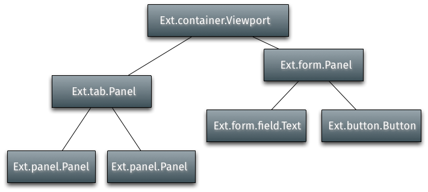

## 组件
一个ExtJS的应用的UI是由许多的组件组成的。所有的组件都是Ext.Component的子类，这使得它们能够进行自动化生命周期管理，包括实例化，渲染，大小和定位以及销毁。ExtJS提供了各种开箱即用的组件，任何组件都能够轻松扩展，以创建自定义的组件。

<!-- more -->

## 组件层次结构
容器（Container）是一个可以容纳其它组件的特殊组件。典型的应用程序由树状结构中的许多嵌套组件组成，称为组件层次结构。容器负责管理子组件的组件生命周期，包括创建，呈现，调整大小和定位以及销毁。典型的应用程序的组件层次结构从顶部的Viewport组件开始，其中包含嵌套在其中的其他容器/组件：



子组件通过容器的items配置添加到容器中。这个例子使用Ext.create()方法创建了两个Panel，然后将它们作为子组件添加到Viewport组件当中。

```js
var childPanel1 = Ext.create('Ext.panel.Panel', {
    title: 'Child Panel 1',
    html: 'A Panel'
});

var childPanel2 = Ext.create('Ext.panel.Panel', {
    title: 'Child Panel 2',
    html: 'Another Panel'
});

Ext.create('Ext.container.Viewport', {
    items: [ childPanel1, childPanel2 ]
});
```


容器使用布局管理器去管理子组件的大小，位置。关于更多布局和容器的信息，请参考：



## XTypes和懒实例化
每一个组件都有一个叫做xtype的标识。例如，Ext.panel.Panel的xtype是'panel'。上面的例子展示了如何添加一个已经实例化好了的组件到容器中。在一个大型的应用中，这并非最好的做法，因为并不是所有的组件都需要立即实例化，一些组件可能永远也不会被实例化，具体取决于应用程序的使用方式。例如一个应用使用了Tab Panel，则只有当用户点击每个tab的时候才会渲染每个tab的内容。xtypes的作用就是允许容器的子组件可以配置，但是不实例化，直到容器认为有必要实例化了。

以下的这个例子使用Tab Panel演示了如何懒实例化和延迟渲染子组件。每一个tab都有一个事件监听器，当tab渲染完成之后，将会弹出一个alert。
```js
Ext.create('Ext.tab.Panel', {
    renderTo: Ext.getBody(),
    height: 100,
    width: 200,
    items: [
        {
            // Explicitly define the xtype of this Component configuration.
            // This tells the Container (the tab panel in this case)
            // to instantiate a Ext.panel.Panel when it deems necessary
            xtype: 'panel',
            title: 'Tab One',
            html: 'The first tab',
            listeners: {
                render: function() {
                    Ext.MessageBox.alert('Rendered One', 'Tab One was rendered.');
                }
            }
        },
        {
            // xtype for all Component configurations in a Container
            title: 'Tab Two',
            html: 'The second tab',
            listeners: {
                render: function() {
                    Ext.MessageBox.alert('Rendered One', 'Tab Two was rendered.');
                }
            }
        }
    ]
});
```


## 显示（show）和隐藏（hide）
所有的组件都内置了显示和隐藏的方法。默认的隐藏的css方法是设置“display:none”,但是可以在hideMode这个配置属性来修改。
```js
 var panel = Ext.create('Ext.panel.Panel', {
        renderTo: Ext.getBody(),
        title: 'Test',
        html: 'Test Panel',
        hideMode: 'visibility' // use the CSS visibility property to show and hide this
component
    });

    panel.hide(); // hide the component

    panel.show(); // show the component
```

## 浮动组件
浮动组件使用CSS绝对定位位于文档流的外部，不参与其容器的布局。默认情况下，一些组件（如Window）会浮动，但是任何组件都可以使用floating配置来进行浮动。
```js
var panel = Ext.create('Ext.panel.Panel', {
    width: 200,
    height: 100,
    floating: true, // make this panel an absolutely-positioned floating component
    title: 'Test',
    html: 'Test Panel'
});
```
上面的代码实例化了一个Panel但是没有渲染它。正常的一个组件要么有一个renderTo配置要么就是作为一个子组件添加到一个容器中，但是在浮动组件的情况下，这些都不是必需的。浮动组件在第一次调用show方法时自动渲染到body。
```js
panel.show(); // render and show the floating panel
```
以下是与浮动组件相关的其他配置和方法：

* draggable - 浮动组件在屏幕上能够拖动。
* shadow - 自定义浮动组件的阴影的外观。
* alignTo() - 将浮动组件与特定元素对齐。
* center() - 将浮动组件在容器中居中。

## 创建自定义组件

### 组合或扩展
当创建一个新的UI类的时候，必须决定该类是否拥有组件的实例或者继承自组件。

建议将最近的基类扩展到所需的功能。这是因为Ext JS提供的自动化生命周期管理，包括在需要时进行自动呈现，在由适当的布局管理器进行管理时对组件进行自动调整和定位，以及从容器中删除时的自动销毁。编写一个组件的新类更容易，并且可以在组件层次结构中占据一席之地，而不是Ext JS组件的新类，必须从外部呈现和管理它。

### 子类
类系统使得扩展ExtJs框架的任何一部分都非常容易。

Ext.Base是所有Ext JS类的构建块，此类的原型和静态成员都由所有其他类继承。虽然您可以通过Ext.Base在最低级别开始添加功能，但在许多情况下，开发人员希望在继承链中启动更高级别。

以下的例子创建了一个Ext.Component的子类：
```js
Ext.define('My.custom.Component', {
    extend: 'Ext.Component',

    newMethod : function() {
       //...
    }
});
```
这个例子创建了一个新类-My.custom.Component，它继承了Ext.Component的所有功能（方法，属性，等等）。可以添加任何新的方法和属性定义到该类中。

### 模板方法
ExtJS使用模板方法模式委托给子类，该行为只针对子类。这意味着继承链中的每个类可能会为组件生命周期中的某些阶段“贡献”一个额外的逻辑。每个类实现自己的特殊行为，同时允许继承链中的其他类继续贡献自己的逻辑。

未完。。。

