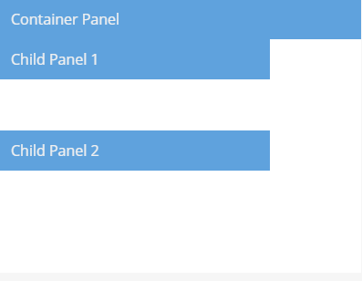
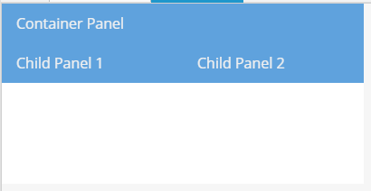

## 布局（Layouts）和容器（Containers）

布局系统是Extjs中非常强大的一部分。它负责处理你应用中每一个组件的大小和位置。这篇文章将讲解布局的基本用法。

<!-- more -->

## 容器（Containers）

Ext JS应用程序UI由组件组成。容器是一个可以包含其他组件的特殊组件。一个典型的Ext JS应用由几层嵌套的组件组成。


最常用的容器是Panel。我们来看看一个容器允许Panel包含其他组件的方式：

```js
Ext.create('Ext.panel.Panel', {
    renderTo: Ext.getBody(),
    width: 400,
    height: 300,
    title: 'Container Panel',
    items: [
        {
            xtype: 'panel',
            title: 'Child Panel 1',
            height: 100,
            width: '75%'
        },
        {
            xtype: 'panel',
            title: 'Child Panel 2',
            height: 100,
            width: '75%'
        }
    ]
});
```



我们刚刚创建了一个Panel，它将自己渲染到html的body中，然后我们使用items配置添加了两个子Panel到我们的容器Panel中（就是Container Panel）。


## 布局（Layouts）

每一个容器都有一个布局来管理子组件的大小和位置。在这个段落，我们将讨论如何给容易配置一个指定的布局，以及布局系统是怎样保持同步的。

### 使用布局

在上面列子中我们没用指定布局给容器Panel。注意子Panel是一个接着一个的排列，正如DOM中的块级元素一样。之所以会如此是因为所有的容器都有一个默认布局-自动布局（Auto Layout）。自动布局不需要指定子组件任何的位置属性或者大小规则。我们假设，例如，我们希望两个子组件Panel并排排列，并且每个子组件Panel占50%的宽度-我们可以通过在容器Panel中使用列布局（Column Layout）来实现。

```js
Ext.create('Ext.panel.Panel', {
    renderTo: Ext.getBody(),
    width: 400,
    height: 200,
    title: 'Container Panel',
    layout: 'column',
    items: [
        {
            xtype: 'panel',
            title: 'Child Panel 1',
            height: 100,
            columnWidth: 0.5
        },
        {
            xtype: 'panel',
            title: 'Child Panel 2',
            height: 100,
            columnWidth: 0.5
        }
    ]
});
```



Ext JS提供了一整套布局，几乎可以满足任意类型的布局要求。

## 布局系统的工作原理

一个容器的布局负责所有子组件的初始位置和大小。在框架内部，会调用容器的updateLayout方法，改方法触发layout事件来计算所有的容器的子组件的正确大小和位置，并更新DOM。updateLauyout方法完全是递归的，所以任何容易的子组件都会调用自身的updateLayout方法。一直到达组件层次结构的最底部。您通常不必在应用程序代码中调用updateLayout（），因为框架应该为您处理。


当容器大小改变或者添加，移除子组件的时候会触发重新布局。正常情况下我们可以依赖框架来处理布局的更新，但是在一些情况下，我们希望阻止框架自动布局，所以我们可以批量多个操作，然后再完成之后，手动触发布局。为此，我们使用容器上的suspendLayout标志来防止它在我们正常触发一个布局的时候，自动触发布局。（例如，添加，移除子组件）。当我们完成了所有要做的事情之后，就可以关闭suspendLayout标志，并通过调用容器的updateLayout方法来手动触发布局。

```js
var containerPanel = Ext.create('Ext.panel.Panel', {
    renderTo: Ext.getBody(),
    width: 400,
    height: 200,
    title: 'Container Panel',
    layout: 'column',
    suspendLayout: true // Suspend automatic layouts while we do several different things that could trigger a layout on their own
});

// Add a couple of child items.  We could add these both at the same time by passing an array to add(),
// but lets pretend we needed to add them separately for some reason.

containerPanel.add({
    xtype: 'panel',
    title: 'Child Panel 1',
    height: 100,
    columnWidth: 0.5
});

containerPanel.add({
    xtype: 'panel',
    title: 'Child Panel 2',
    height: 100,
    columnWidth: 0.5
});

// Turn the suspendLayout flag off.
containerPanel.suspendLayout = false;
// Trigger a layout.
containerPanel.updateLayout();
```

## 组件布局

就像容器的布局定义了子组件的大小和位置一样，一个组件也包含一个布局用来定义内部子组件的大小和位置。组件布局使用componentLayout配置选项进行配置。
https://docs.sencha.com/extjs/6.2.1/modern/Ext.Component.html#cfg-componentLayout

通常，您不需要使用此配置，除非您正在编写自定义组件，因为所有提供的组件都带有自己的布局管理器。大多数组件使用自动布局，但更复杂的组件将需要自定义组件布局（例如Panel包括header，footer，toolbars）。

原文地址：https://docs.sencha.com/extjs/6.2.1/guides/core_concepts/layouts.html