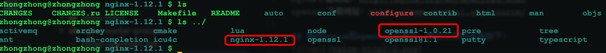
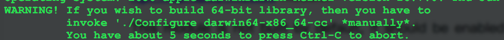
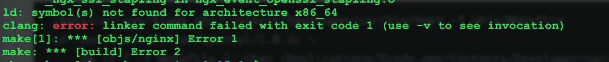
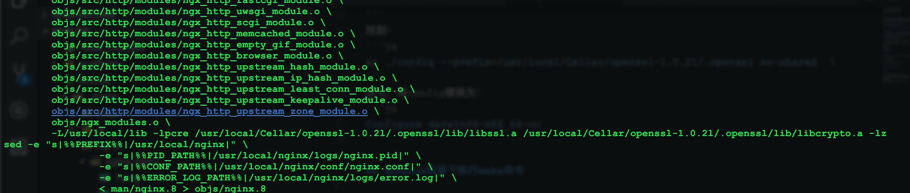
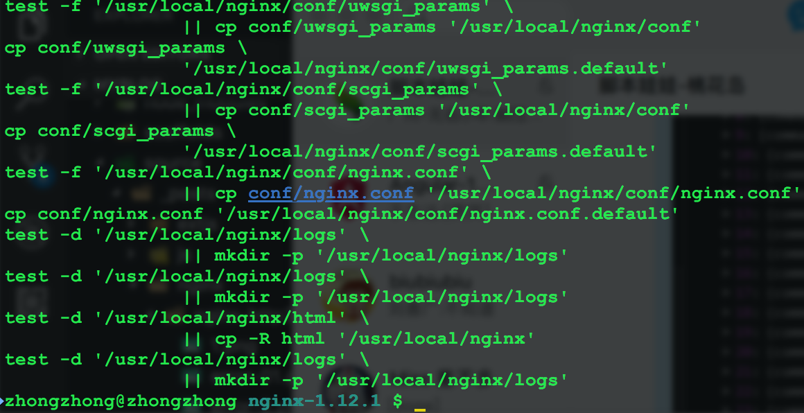
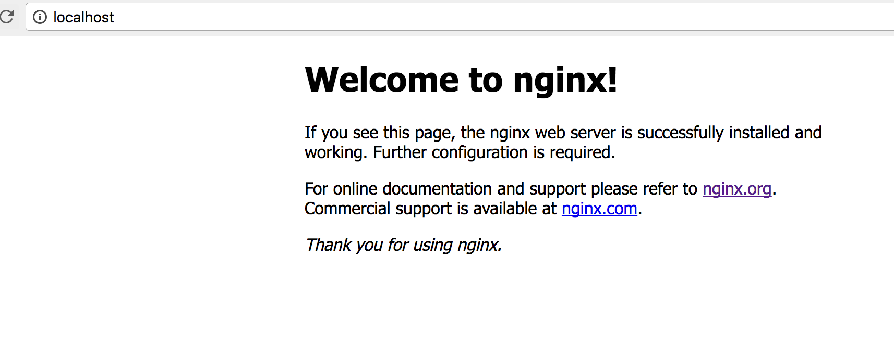
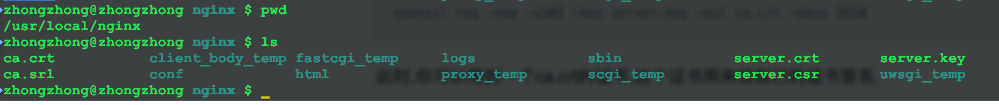
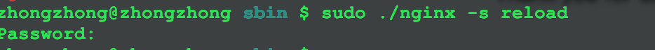
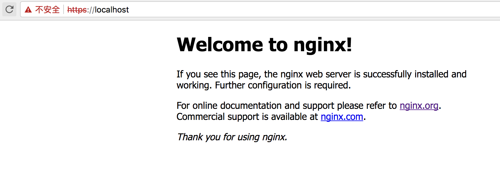
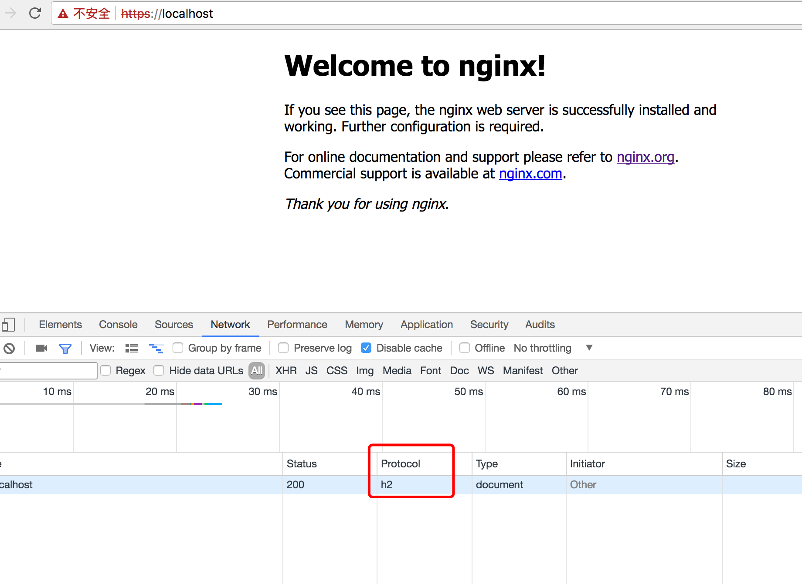

参考：
https://www.widlabs.com/article/mac-os-x-nginx-compile-symbol-not-found-for-architecture-x86_64
http://homeway.me/2015/07/10/rebuild-osx-environment/
http://www.jianshu.com/p/9523d888cf77

## 下载nginx源码，openssl源码压缩包
nginx下载地址：http://nginx.org/en/download.html
openssl下载地址：https://www.openssl.org/source/

## 解压nginx和openssl压缩包，解压之后的目录如下：


<!-- more -->

## 进入到nginx目录，使用configure命令，添加https和http2两个模块，

```js
./configure  --with-http_ssl_module --with-http_v2_module --with-openssl=/usr/local/Cellar/openssl-1.0.2l
```
执行上面的命令，在输出的信息中，你可能会看到以下信息：



如果出现以上信息，那么在命令之后完成之后，需要进入到objs目录，然后修改Makefile文件。

在nginx目录下：
```js
cd objs
vim Makefile
```
找到：
```js
&& ./config --prefix=/usr/local/Cellar/openssl-1.0.2l/.openssl no-shared  \
```
这句，将config替换为：
```js
Configure darwin64-x86_64-cc
```

## 在nginx目录下执行make命令

```js
make
```

如果没有按照上一步中的提示修改Makefile文件，则会出现以下错误：


正常编译完成的输出：


## 安装

```
sudo make install
```

安装完成：


## 测试nginx安装是否成功

启动nginx
```js
sudo /usr/local/nginx/sbin/nginx
```

访问：http:localhost



出现以上页面说明nginx安装成功了。

## 开启https
要开启nginx的https，需要生成SSL Key和CSR文件。
如何生成这些文件参考：
http://www.jianshu.com/p/9523d888cf77

以下是生成文件之后的目录结构，这里我将文件生成在/usr/local/nginx目录下：


然后将/user/local/nginx/conf/nginx.conf中，下面这段配置，去掉注释并修改成以下内容：
```js
server {
    listen       443 ssl;
    server_name  localhost;

    ssl_certificate      /usr/local/nginx/server.crt; 
    ssl_certificate_key  /usr/local/nginx/server.key;

    ssl_session_cache    shared:SSL:1m;
    ssl_session_timeout  5m;

    ssl_ciphers  HIGH:!aNULL:!MD5;
    ssl_prefer_server_ciphers  on;

    location / {
        root   html;
        index  index.html index.htm;
    }
}
```
重新加载nginx,在/usr/local/nginx/sbin目录下执行以下命令：
```js
sudo ./nginx -s reload
```


访问https://localhost出现以下页面说明配置成功。


## 开启http2

到这一步之后，开启nginx的http2非常简单，只需要将上一步中https的配置中
```js
listen       443 ssl;
```
修改为：
```js
listen       443 ssl http2;
```
然后重新启动下nginx，再次访问https://localhost

效果图：



