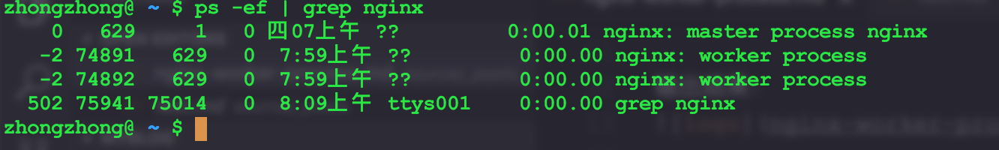

## 查看cpu核心数
### macOs
```js
sysctl -n machdep.cpu.core_count
```
### linux
```js
cat /proc/cpuinfo | grep 'processor' | wc -l
```

输出结果：


说明我的电脑的核心数为2.


## 修改nginx的worker_processes配置
那么这个时候我们打开nginx.conf配置文件，将worker_processes的值设置为2;
说明一下，这个值默认为1。

设置完成，运行以下命令重启nginx：
```js
sudo nginx -s reload
```

## 验证配置是否有效
重启完成之后，运行以下命令查看nginx的进程信息：
```js
ps -ef | grep nginx
```
输出结果：


从图中可以看出，worker process的进程数为2。

## 其他配置

events{
      worker_connections 512;
}
worker_connections配置表示一个worker process并发处理的最大连接数，默认值为512.可以修改这个配置来提高或者减少并发量。
